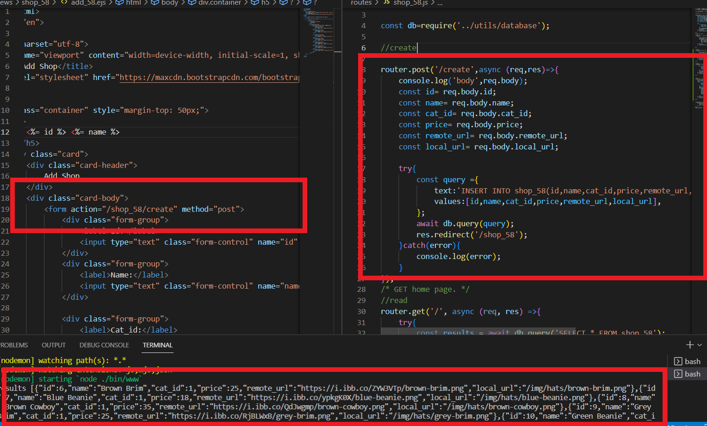
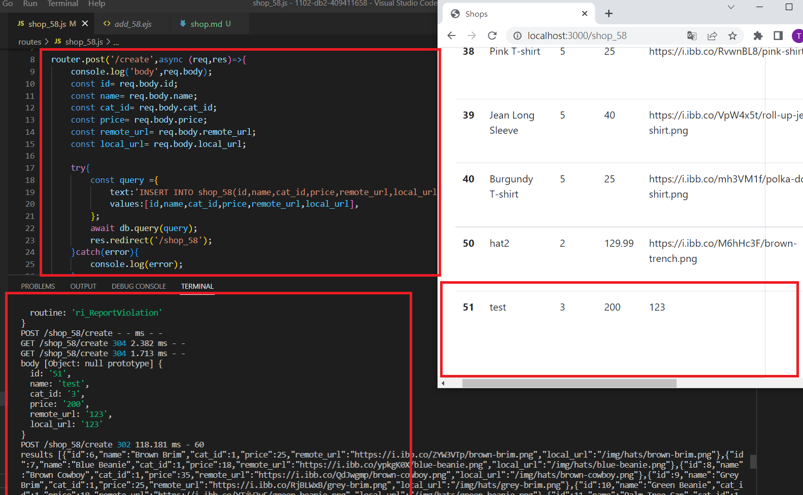
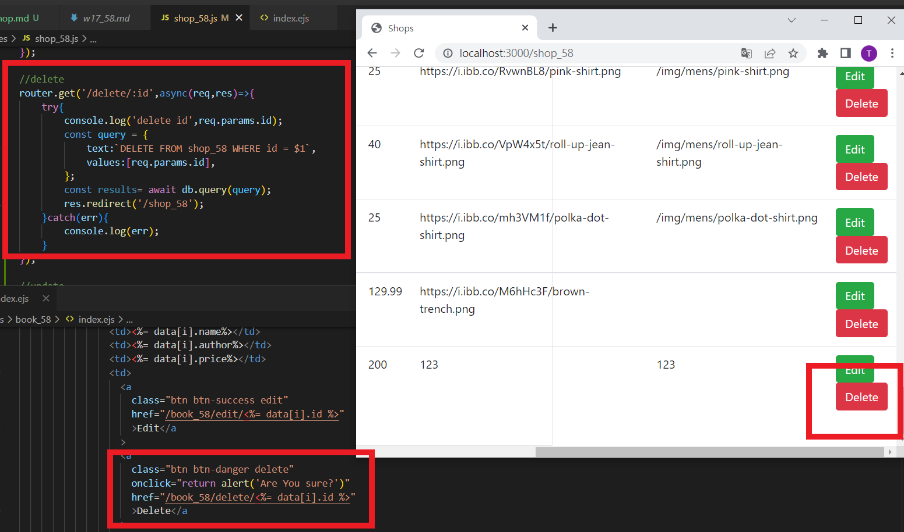
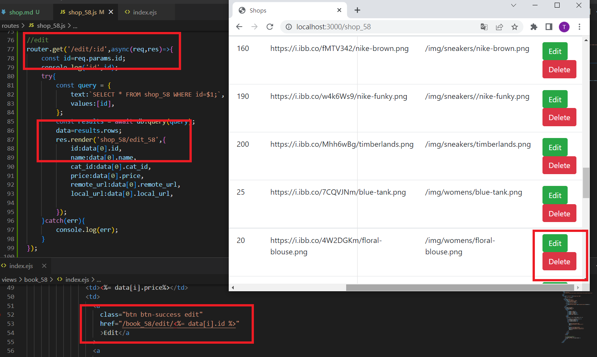
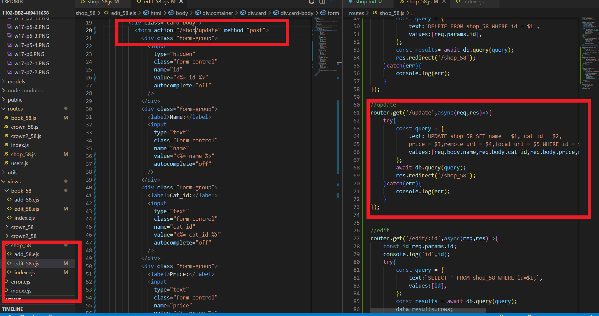

### shop-p1: get all data from table shop_xx

### shop-p2: /shop_xx/create to shop_xx/add_xx.ejs

### shop-p3: POST /shop_xx/create to create a shop data

### shop-p4: implement /shop_xx/delete/:id

### shop-p5: implement /shop_xx/update

