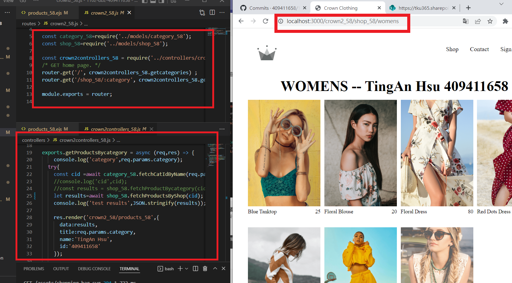
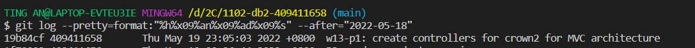
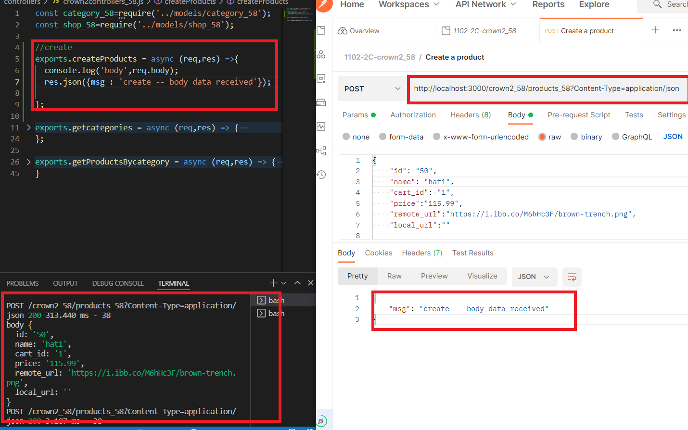

### w13-p1: create controllers for crown2 for MVC architecture





```
$ git log --pretty=format:"%h%x09%an%x09%ad%x09%s" --after="2022-05-18"
19b84cf 409411658       Thu May 19 23:05:03 2022 +0800  w13-p1: create controllers for crown2 for MVC architecture
```

### w13-p2 use Postman to test product body data can be retrieved using route/crown2_58/products_58



### w13-last-log
