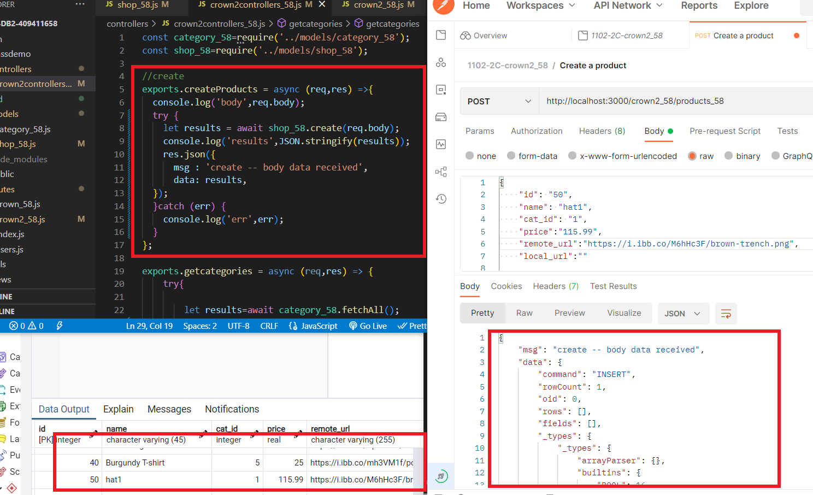
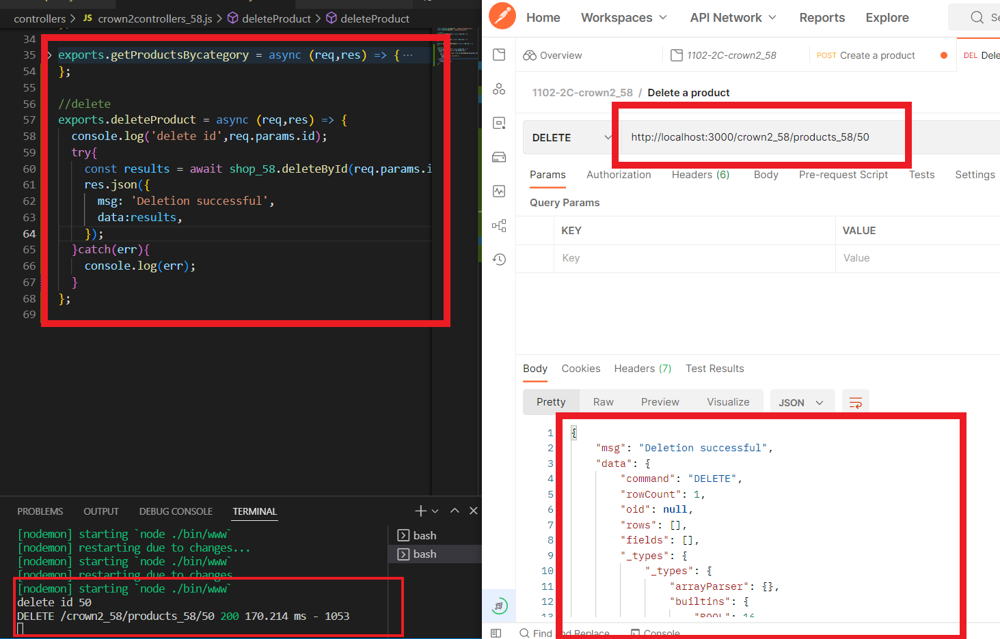
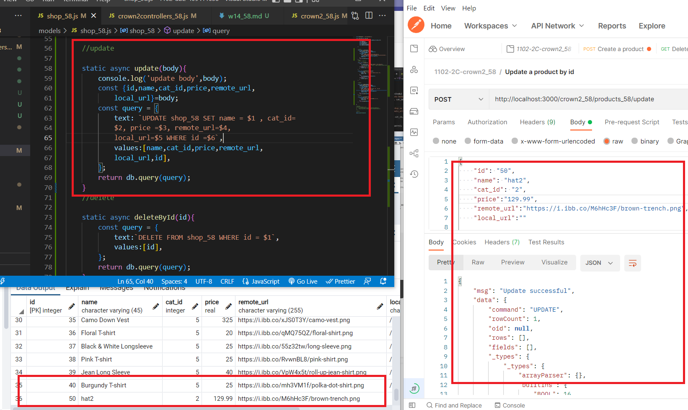

### w14-p1: save a product to postgreSQL server, show code and new data in pgAdmin



### w14-p2: delete a product using route /product_xx/:id



### w14-p3: update a product using route /product_xx/update/:id



### w14-last-log

```
$  git log --pretty=format:"%h%x09%an%x09%ad%x09%s" --after="2022-05-23"
4ffa59a 409411658       Wed May 25 00:10:43 2022 +0800  w14-p3: update a product using route /product_xx/update/:id
```
