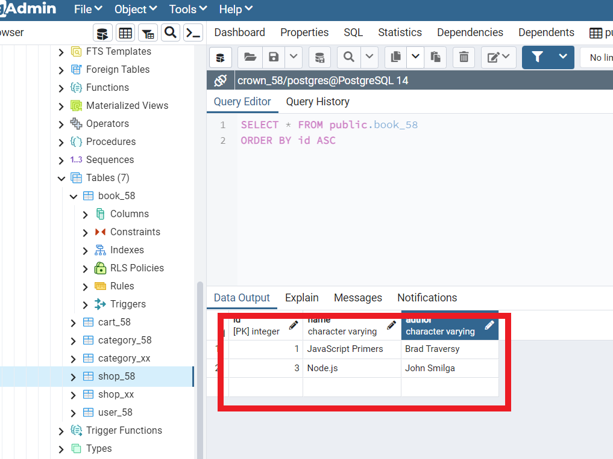
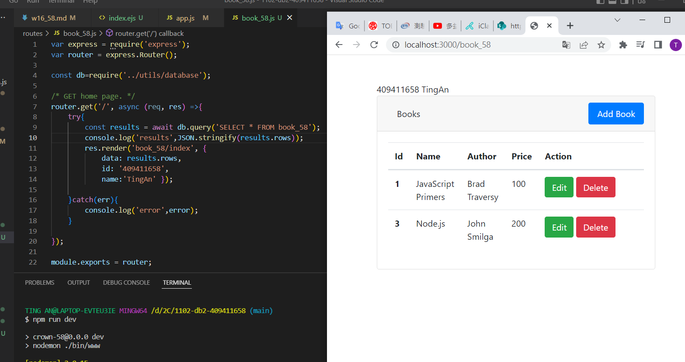
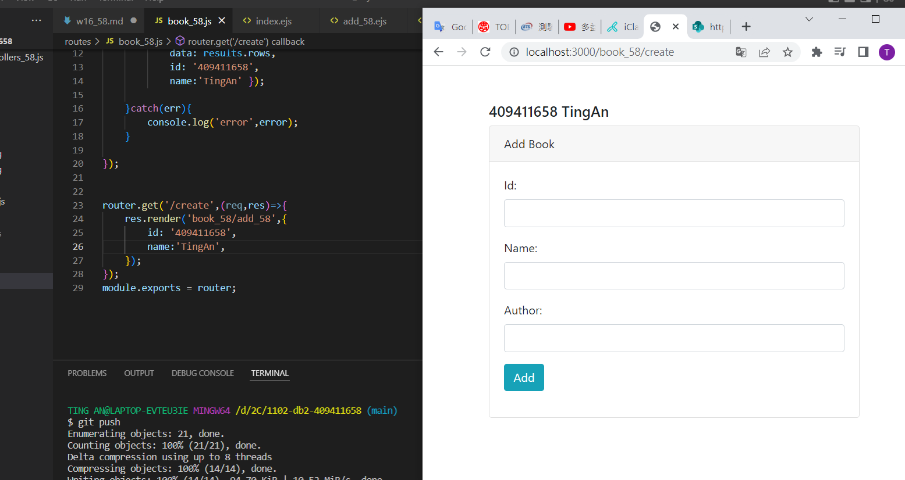
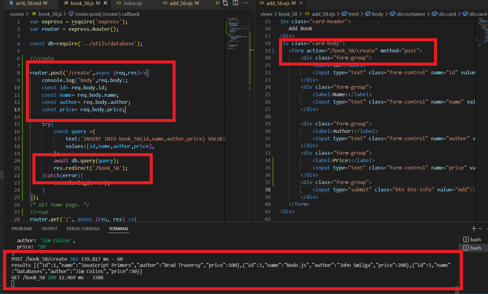
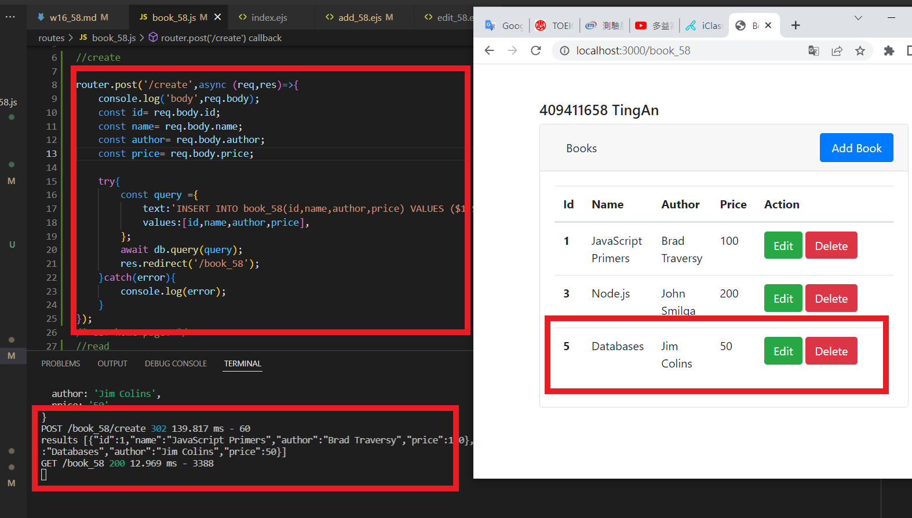
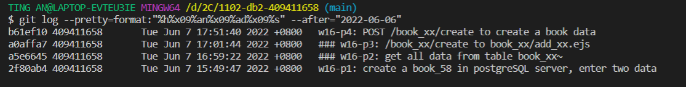

### w16-p1: create a book_58 in postgreSQL server, enter two data



### w16-p2: get all data from table book_xx



### w16-p3: /book_xx/create to book_xx/add_xx.ejs



### w16-p4: POST /book_xx/create to create a book data





### w16-LAST-log



```

$ git log --pretty=format:"%h%x09%an%x09%ad%x09%s" --after="2022-06-06"
b61ef10 409411658       Tue Jun 7 17:51:40 2022 +0800   w16-p4: POST /book_xx/create to create a book data
a0affa7 409411658       Tue Jun 7 17:01:44 2022 +0800   ### w16-p3: /book_xx/create to book_xx/add_xx.ejs
a5e6645 409411658       Tue Jun 7 16:59:22 2022 +0800   ### w16-p2: get all data from table book_xx~
2f80ab4 409411658       Tue Jun 7 15:49:47 2022 +0800   w16-p1: create a book_58 in postgreSQL server, enter two data


```
