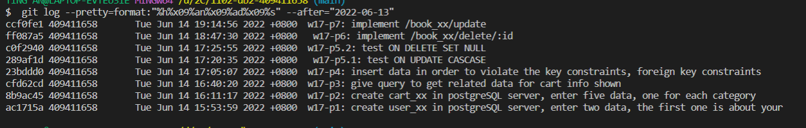

### w17-p1: create user_xx in postgreSQL server, enter two data, the first one is about your


### w17-p2: create cart_xx in postgreSQL server, enter five data, one for each category


### w17-p3: give query to get related data for cart info shown in ejs


### w17-p4: insert data in order to violate the key constraints, foreign key constraints


### w17-p5.1: test ON UPDATE CASCASE


### w17-p5.2: test ON DELETE SET NULL


### w17-p6: implement /book_xx/delete/:id


### w17-p7: implement /book_xx/update


### w17-LAST-log



```
$  git log --pretty=format:"%h%x09%an%x09%ad%x09%s" --after="2022-06-13"
ccf0fe1 409411658       Tue Jun 14 19:14:56 2022 +0800  w17-p7: implement /book_xx/update
ff087a5 409411658       Tue Jun 14 18:47:30 2022 +0800   w17-p6: implement /book_xx/delete/:id
c0f2940 409411658       Tue Jun 14 17:25:55 2022 +0800  w17-p5.2: test ON DELETE SET NULL
289af1d 409411658       Tue Jun 14 17:20:35 2022 +0800   w17-p5.1: test ON UPDATE CASCASE
23bddd0 409411658       Tue Jun 14 17:05:07 2022 +0800  w17-p4: insert data in order to violate the key constraints, foreign key constraints
cfd62cd 409411658       Tue Jun 14 16:40:20 2022 +0800  w17-p3: give query to get related data for cart info shown
8b9ac45 409411658       Tue Jun 14 16:11:17 2022 +0800  w17-p2: create cart_xx in postgreSQL server, enter five data, one for each category
ac1715a 409411658       Tue Jun 14 15:53:59 2022 +0800  w17-p1: create user_xx in postgreSQL server, enter two data, the first one is about your
```
